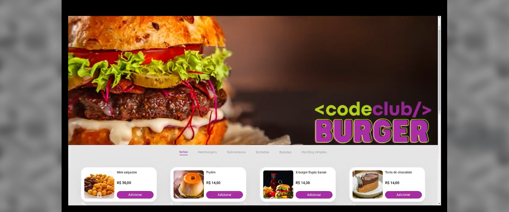

<div align="center">
  <br />
  
  <br />
  <div>
    
    
    
    
    
    
  </div>
  <h3 align="center">🍔 Code Burguer — Admin Panel</h3>

  <div align="center">
    A complete management system for restaurants and delivery apps
  </div>
</div>

---

## 📋 Table of Contents

1. 🤖 [About the Project](#about)
2. ⚙️ [Tech Stack](#tech-stack)
3. 🚀 [Features](#features)
4. 🧪 [Setup](#setup)
5. 📸 [Screenshots](#screenshots)

---

## 🤖 <a name="about"></a>About the Project

This is a modern admin panel for managing a digital burger shop. The system includes full CRUD functionality for orders, products, categories, banners, and users — all organized in a smooth, responsive interface.

---

## ⚙️ <a name="tech-stack"></a>Tech Stack

- **React 18**
- **React Router DOM v6**
- **Material UI**
- **Styled Components**
- **React Hook Form + Yup**
- **Framer Motion**
- **React Toastify**
- **Axios**

---

## 🔋 <a name="features"></a>Features

- ✅ Authentication with user roles
- 🍔 Product, category and banner management (CRUD)
- 📦 Order tracking by status
- 👥 User and admin management
- 📊 Dashboard with metrics and chart cards
- 🎨 Modern UI using MUI components
- 📱 Responsive layout
- 🔔 Toast notifications for feedback
- 💾 Axios integration for data persistence

---

## 🤸 <a name="setup"></a>Setup

**Running the Project**

bash
npm run dev

Open [http://localhost:5173](http://localhost:5173/) in your browser to view the project.

**Clone the project**

```bash
git clone https://github.com/seu-usuario/code-burguer-react.git
cd code-burguer-react
```
